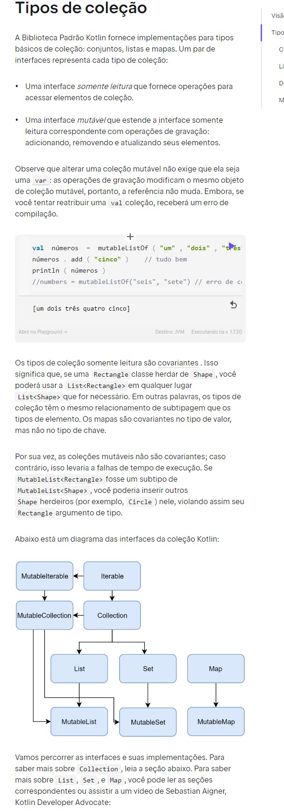
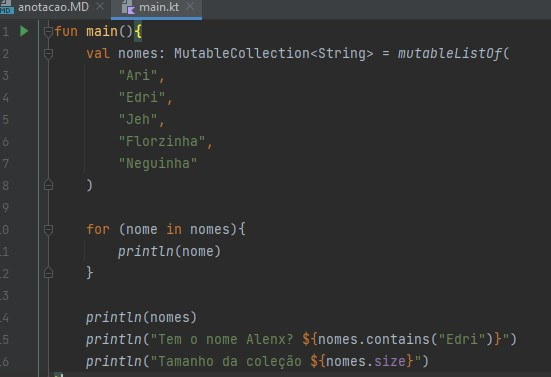
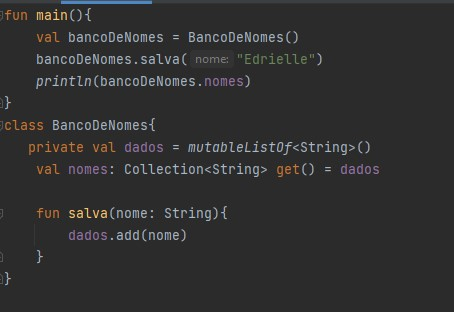
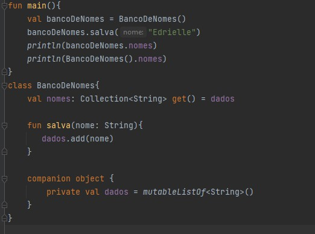
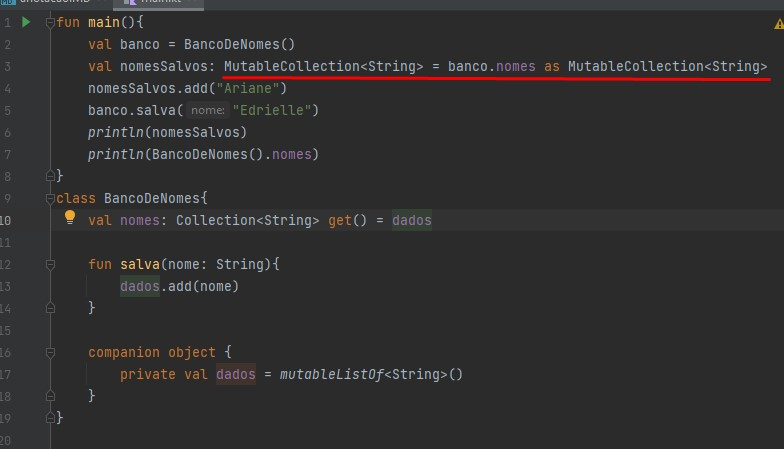
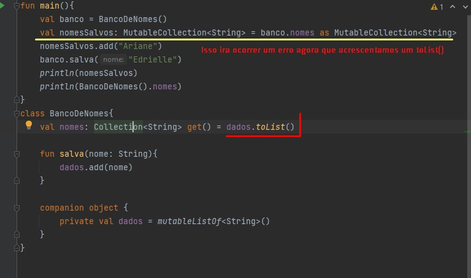

# Collections

[Collections Informacao Link](https://kotlinlang.org/docs/collections-overview.html#collection-types)

[Iterators](https://kotlinlang.org/docs/iterators.html)

[Construncting Collections](https://kotlinlang.org/docs/constructing-collections.html)

Teste as referências Iterable e Collection. No teste, crie uma lista de nomes ou qualquer tipo que desejar.
Então, atribua a lista de nomes para uma variável de Iterable ou Collection.
Escreva códigos que utilizem recursos contidos em Iterable, como for loop e o contains(). Então, rode o programa e confira se funciona como esperado.
Faça o mesmo mudando a referência de Iterable para Collection e aproveite a mudança para testar comportamentos exclusivos de Collection, por exemplo, o size.
O objetivo desta atividade é explorar as possibilidades das referências mais genéricas das coleções.

## Tipos de Coleção

Abaixo criei uma MutableList passando no for e fazendo algumas solicitações, ex: tamanho da lista

                val nomes: MutableList<String> = mutableListOf(
                    "Ari",
                    "Edri",
                    "Jeh",
                    "Florzinha",
                    "Neguinha"
                )
            
                for (nome in nomes){
                    println(nome)
                }
            
                println(nomes)
                println("Tem o nome Alenx? ${nomes.contains("Edri")}")
                println("Tamanho da coleção ${nomes.size}")

Podemos ser mais especifico com o tipo? Sim! Vamos tentar o InterableList.

* Nota-se na imagem que o kotlin reclama do size, porque? Pois o mesmo não é atribuído ao tipo `interable`, mas ele é ao
tipo MutableList e o MutableCollection, então vamos atribuir como MutableColecction e o erro desaparece;

* Add no MutaIterable tambem não adiciona novo valor; 
* O MutaIterable ele é um metodo mais restrito, por mais que seja mutavel, ele não add; Ai temos que alterar pra MutableCollection

No codigo abaixo vamos definir o codigo como leitura, mesmo que é mutavel:

                val nomes: Collection<String> = mutableListOf(
                    "Ari",
                    "Edri",
                    "Jeh",
                    "Florzinha",
                    "Neguinha"
                )

o Collection<String> quer dizer que é so leitura então não da pra add e remove;

Vamos criar uma classe chama bando de nomes e adicionar nomes nela:

            fun main(){
                val bancoDeNomes = BancoDeNomes()
                bancoDeNomes.nomes.add("Edrielle")
                println(bancoDeNomes.nomes)
            }
            class BancoDeNomes{
                val nomes = mutableListOf<String>()
            }

Ai vai ser ok. So que nesse tipo de abordagem que a gente está vendo aqui estamos quebrando os princípios da orientação a objetos, que envolve a questão de encapsulamento,
porque o responsável por manipular as informações internas não pode deixar que qualquer um de fora faça essa manipulação, porque dessa forma a gente perde até mesmo a confiabilidade no código
Veja que aqui a gente precisa ter alguns cuidados. O primeiro deles é justamente restringir qualquer tipo de acesso de coleção que seja mutável. Isso é necessário em qualquer solução que você fizer.
Vai trabalhar com alguma coleção mutável? Evite o máximo possível deixar ela exposta para qualquer um de fora. Sempre tente trabalhar com o modo privado.

Dado que agora a gente está trabalhando com o modo privado, como a gente pode fazer para que a gente exponha essas informações? Uma das maneiras que a gente pode fazer é criar mais uma property, que pode se chamar princípio de nomes. 
Essa property vai ser uma collection de string apenas de leitura. E dado que é uma collection de string apenas de leitura, a gente pode fazer com que sua implementação devolva esse outro nomes que a gente está vendo.

* private val dados = mutableListOf<String>() // variavel privada contendo a lista, onde ngm de fora acessa
* val nomes: Collection<String> get() = dados // Onde fora da classe vc vai ter acesso apenas pra ler a lista, na qual é atribuida a ela que é: `dados`
* fun salva(nome: String){ dados.add(nome) } // função methodo pra ir adicionando elementos na lista.

Tem mais um detalhe, agora só para finalizar, que dessa maneira como a gente fez, sempre que a gente criar um objeto vai limpar nossa lista, porque cada objeto vai ter uma lista diferente. Se chegar aqui e colocar nomes, 
uma instância, e pegar os nomes, banco de nomes, e lista de nomes, a gente vai perceber que os dados serão diferentes, porque a gente está sempre atrelando aqui nossa mutable list para o objeto.
Uma das coisas que a gente pode fazer, que a gente aprendeu em outros cursos é colocar como companion. “Alt + Enter” em dados, move to companion object. Aí se tornando companion object, olha o que vai acontecer. Ele colocou o companion antes, não é necessários, vou até tirar aqui.

Dessa maneira como a gente está colocando agora, olha como fica. Ao executar o código a gente vai perceber que os dados serão mantidos. Se a gente salvou alguma vez em algum lugar eles serão mantidos, mesmo que seja uma property, que sejam comportamentos, membros vinculados ao objeto, porque no companion object a gente consegue ter esse tipo de comportamento.

* Foi selecionado nome dados e apertei Alt + enter e cliquei em move to companion object. Ele colocou o companion antes, não é necessários.

Implemente o código para o banco de nomes. Para isso, considere as seguintes características:

`Uma coleção mutável interna e uma imutável pública
Comportamento para salvar nomes
Companion object na coleção mutável para manter os dados
Ao finalizar a implementação, rode o programa e confira se funciona como esperado.`

## Copiando Coleções

Se atribuimos a classe Banco de nomes a uma variavel e passar o tipo como MutableCollection e atribuir ela com `as` conforme a imagem abaixo
poderemos alterar, e dessa forma não adiantou nada privar e fazermos dessa maneira.

Ai poderemos alterar, na documentação do Kotlin na construção de collection, no modo de copy, é explicado tb [Informação Copy](https://kotlinlang.org/docs/constructing-collections.html#copy).

Para isso não ocorrer, colocamos na hora de passar a variavel da lista como `toList().

`Modifique o código para impedir o casting de Collection para MutableCollection.
Para isso, no momento que é retornada a lista mutável, utilize o método de cópia toList() para copiar a lista mutável para uma lista imutável.
Após o ajuste, atribua a lista de nomes para uma variável do tipo MutableCollection<String> e, então, faça o casting. Rode o programa e confira se apresenta uma exception de cast.
Se tudo ocorrer bem, modifique a referência da variável local para Collection<String> e confira se o resultado dela é diferente dos nomes que foram salvos no banco de dados.`