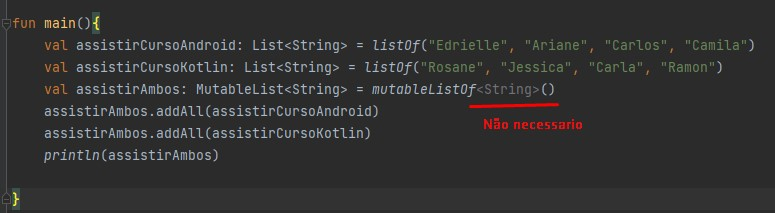
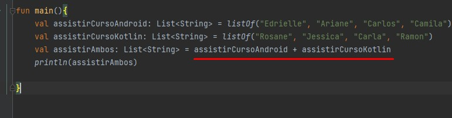
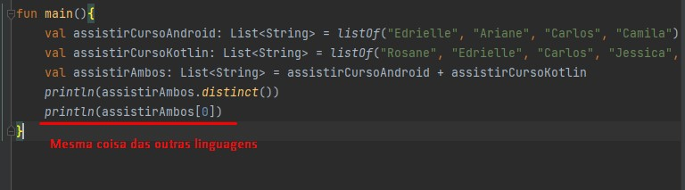
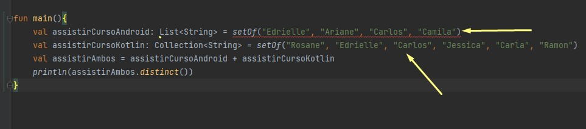
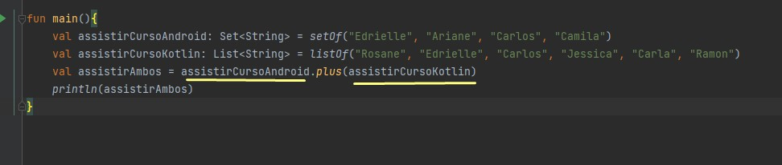
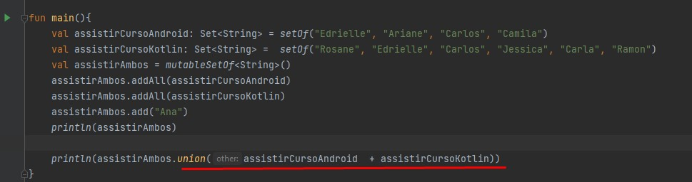
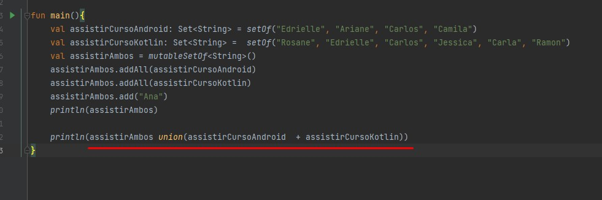
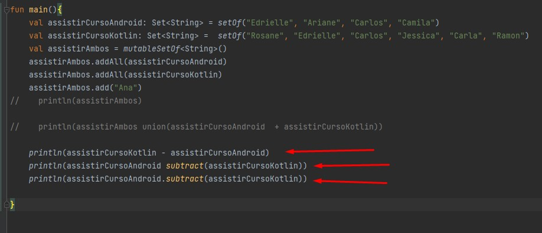
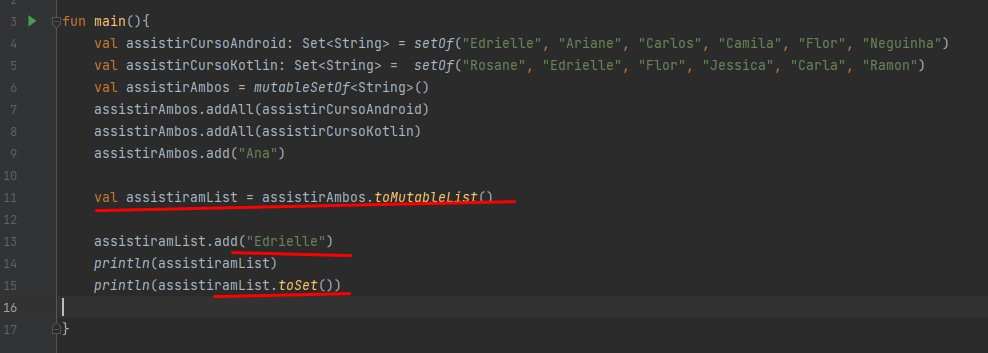

# Criando colecoes com o set

## Devolvendo elementos com distinct

Vamos criar três listas de assistiu curso androi, kotlin e ambos.

            fun main(){
                val assistirCursoAndroid: List<String> = listOf("Edrielle", "Ariane", "Carlos", "Camila")
                val assistirCursoKotlin: List<String> = listOf("Rosane", "Jessica", "Carla", "Ramon")
                val assistirAmbos: MutableList<String> = mutableListOf<String>()
                assistirAmbos.addAll(assistirCursoAndroid)
                assistirAmbos.addAll(assistirCursoKotlin)
                println(assistirAmbos)
            
            }

            //resultado
             [Edrielle, Ariane, Carlos, Camila, Rosane, Jessica, Carla, Ramon]

* Resultado da junção das duas listas, conforme acima, com metodo addAll que vem do MutableList, poderiamos não ter aquele Sting ante do > ()

O ambos por ser mutablelist dessa forma posso usar alguns comportamentos que coleções mutáveis permitem para adicionar, que seria o add all.
Esse add all permite a gente adicionar outra coleção dado aqui a sua referência. A gente pode mandar, por exemplo, o assistiram curso Android, 
que aí ele vai ser adicionado.

Outra maneira de fazer é utilizando o + 

* Lembrando que a ordem importa pra junção, as vezes você quer que a ordem de uma lista fica na frente de outras.

                            // resultado [Edrielle, Ariane, Carlos, Camila, Rosane, Jessica, Carla, Ramon]

Só que temos problema da junção se for repetida as listas, ela vai repetir os nomes, so que não queremos que ocorra a repetição, podemos usar o `distinct()`.

O objetivo do distinct é `o objetivo dele é realmente devolver uma nova lista que vai ter apenas os elementos distintos.`

Ele ira retirar elementos repetidos

                fun main(){
                    val assistirCursoAndroid: List<String> = listOf("Edrielle", "Ariane", "Carlos", "Camila")
                    val assistirCursoKotlin: List<String> = listOf("Rosane", "Edrielle", "Carlos", "Jessica", "Carla", "Ramon")
                    val assistirAmbos: List<String> = assistirCursoAndroid + assistirCursoKotlin
                    println(assistirAmbos.distinct())
                
                }
                // resultado 
                    [Edrielle, Ariane, Carlos, Camila, Rosane, Jessica, Carla, Ramon]

Só que perceba que da maneira como a gente fez a gente dependeu muito de uma função, que nesse caso é uma função que é uma extensão de iterable, 
não é um comportamento próprio da nossa coleção.

## Utilizando o Set

Pegando elemento de uma lista:

Mas a gente pode ter um set de string que os seus nomes não se repetem, sets de números que os números não se repetem, ou até mesmo de objetos nossos que não se repetem. Essa é uma característica comum no set.
O que a gente também pode pegar de informação? Que aqui no set a ordem não tem muita significância. Veja que não vamos ter tantos comportamentos relacionados à ordem, assim como a gente tem na lista que envolve 
seus índices. A gente vai ver com calma dos nossos códigos. Agora que a gente teve essa introdução.

Criando  set

            val assistirCursoAndroid: Set<String> = setOf("Edrielle", "Ariane", "Carlos", "Camila")

* Lembrando: `A gente vai entender passo a passo por que isso aconteceu. Eu comentei sobre list collection, mas na verdade é só o collection, porque list está no mesmo nível de hierarquia de set.
O set não herda de list. Então, por isso a gente não pode devolver a referência dele para uma lista. Mas para uma collection a gente viu que consegue. Roda nosso código e funciona.`

COMO DITO:
* setOf ta no mesmo nivel de list, então nao da pra ser do tipo list com setOf
* setOf da pra collection, o tipo pode ser uma collection.
A imagem abaixo explica, List<string> = setOf() == erro, já tipo collection não.

Ao inves de + ali somando a lista, podemos inserir o plus:

        fun main(){
            val assistirCursoAndroid: Set<String> = setOf("Edrielle", "Ariane", "Carlos", "Camila")
            val assistirCursoKotlin: List<String> = listOf("Rosane", "Edrielle", "Carlos", "Jessica", "Carla", "Ramon")
            val assistirAmbos = assistirCursoAndroid.plus(assistirCursoKotlin)
            println(assistirAmbos)
        }

So que vejamos, quando vamos juntar as duas listas `assistirCursoAndroid` + `assistirCursoKotlin` e atribuir a variavel `assistirAmbos`
a variavel `assistirAmbos` o tipo dela vai depender de quem vem primeiro, na foto abaixo o `assistirCursoAndroid` vem primeiro e o tipo dele é
`Set<String>` ou seja  `assistirAmbos` vai ser do tipo `set<String>` pq vem primeiro, agora se `assistirCursoKotlin` vinhsesse primeiro ali, 
`assistirAmbos` seria do tipo `List<String> ` , segue imagem abaixo:

Se a variavel que ira receber a junção de duas lista, se ela for do tipo set<List> não tera como buscar a posição do elemento na array dessa maneira:
`assistirAmbos[0]`

Funciona:

      fun main(){
        val assistirCursoAndroid: MutableSet<String> = mutableSetOf("Edrielle", "Ariane", "Carlos", "Camila")
        val assistirCursoKotlin: MutableSet<String> =  mutableSetOf("Rosane", "Edrielle", "Carlos", "Jessica", "Carla", "Ramon")
        val assistirAmbos = mutableSetOf<String>()
        assistirAmbos.addAll(assistirCursoAndroid)
        assistirAmbos.addAll(assistirCursoKotlin)
        println(assistirAmbos)
      }

Tambem funciona:

      fun main(){
          val assistirCursoAndroid: Set<String> = mutableSetOf("Edrielle", "Ariane", "Carlos", "Camila")
          val assistirCursoKotlin: Set<String> =  mutableSetOf("Rosane", "Edrielle", "Carlos", "Jessica", "Carla", "Ramon")
          val assistirAmbos = mutableSetOf<String>()
          assistirAmbos.addAll(assistirCursoAndroid)
          assistirAmbos.addAll(assistirCursoKotlin)
          println(assistirAmbos)
      }

e também funciona:

      fun main(){
        val assistirCursoAndroid: Set<String> = setOf("Edrielle", "Ariane", "Carlos", "Camila")
        val assistirCursoKotlin: Set<String> =  setOf("Rosane", "Edrielle", "Carlos", "Jessica", "Carla", "Ramon")
        val assistirAmbos = mutableSetOf<String>()
        assistirAmbos.addAll(assistirCursoAndroid)
        assistirAmbos.addAll(assistirCursoKotlin)
        println(assistirAmbos)
      }

Como sempre não da pra buscar o indice do elemento assim `assistirAmbos[0]` ate pq não faz sentindo, mas posso adicionar mais nomes na lista
vou adicionar `Ana`

      assistirAmbos.add("Ana")

E se eu adiocionar um nome existente, tipo Ana de novo?

  - Ele tenta ate adiconar mas o set não deixa repetir elementos já existentes.

# Comportamentos do Set

[Link Set specific](https://kotlinlang.org/docs/set-operations.html)

Tem alguns comportamentos aqui específicos do set e vão ser exatamente esses comportamentos que vamos explorar para entender 
quando a gente pode considerar seu uso e assim por diante, que seria o union, subtract e intercept. Vamos ver o que cada um deles representa para a gente.

## Union
* union()
Ela faz a junção de duas listas conforme nos exercicios anterios.

Quais são as diferenças que a gente tem? Uma que é a implementação, ela acaba sendo diferente. Se a gente pega essa união que
a gente viu é uma implementação mais genérica, não só focada na parte do set, pode receber qualquer iterable, e aqui na união a gente vê que é diferente. Essa é uma das coisas.
Outro detalhe que acaba sendo diferente é que esse union vai ter uma característica de implementação que a gente chama de infix no Kotlin. O que significa essa característica? 
Significa que a gente pode fazer essa parte da união sem chamar dessa maneira convencional.

Ele não precisa ser chamado do modo convencional, ex: `nomeVariavel.union()`, simplismente chamaria: `nomeVariavel union()`
Basicamente, a gente não teria esse ponto, colocaria o espaço, e dessa maneira a gente pode também chamar o método sem nenhum problema. Ele vai compilar numa boa. 
Isso porque na sua implementação a gente tem esse tal de infix, que dá essa característica para que a gente consiga chamar os comportamentos sem ter necessidade de vincular por meio de pontos.

Se a gente mudar a ordem vai ter algum resultado diferente? Nesse caso específico não, porque realmente é só quem estiver tanto em um conjunto como no outro. Até na matemática a gente faz, 
conjunto A e conjunto B, se estiver em ambos os conjuntos essa é a intersecção. Aqui também temos exatamente esse mesmo resultado.

## Subtract
Podemos fazer a subtração, ao inves de somar, diminuir.. ex:
No exemplo abaixo, iremos ver três tipos de subtração, lembra do union? tem o subtract(), pode ser utilizado sem o ponto, chamada convencional
Tem diferença da ordens no resultado? `SIM!`.. 

* Nesse modelo chamei a lista de `assistirCursoKotlin` primeiro, o resultado, vai ser o nome das pessoas que esta na `assistirCursoKotlin`, mas que não esta na lista `assistirCursoAndroid` > println(assistirCursoKotlin - assistirCursoAndroid)
Resposta: [Rosane, Jessica, Carla, Ramon]

* Nesse modelo o segundo e o terceiro são o mesmo resultado, a diferença foi na chamada do subtract, so que chamei primeiro o `assistirCursoAndroid`, então o resultado vai ser o nome das pessoas que estão na lista `assistirCursoAndroid`, mas
que não estão na lista `assistirCursoKotlin`, resultado: [Ariane, Camila].

* Terceiro como dito em cima, so mudou a forma de chamar sem o `nomvevariavel subtact()`

## Intersect

A gente viu que tem o tal do intersect, ele vem da intersecção, que é pegar exatamente os membros que fazem parte do primeiro conjunto como do outro, que seria uma situação na qual a gente quer mandar o 
e-mail exatamente para as pessoas que assistiram tanto o curso de Android como o curso de Kotlin. Para isso, a gente pode pegar as pessoas que assistiram o curso de Kotlin, fazemos um intersect com as pessoas que assistiram o curso de Android.

Exemplo: 

                   println(assistirCursoAndroid.intersect(assistirCursoKotlin))
                   println(assistirCursoKotlin intersect(assistirCursoAndroid))

                    // resultado

                    [Edrielle, Flor]
                    [Edrielle, Flor]

Ou seja, o intersect pega nomes que estão em ambas listas.

Vou mostrar uma coisa bastante interessante que pode ser útil no seu dia a dia, que é o seguinte. Vamos transformar para um mutable list e a partir desse mutable list vou chamar ele de assistiram list, só para a gente deixar bem claro. 
A partir desse mutable list vou adicionar um membro repetido, por exemplo, assistiram list add Edrielle.
Fazendo isso, olha o que vamos ter. Novamente vamos voltar com aquela mesma lista que a gente tinha antes que podia repetir os membros. O Alex está no começo e no final.
Só que dado que existe essa ideia de cópia, olha o que a gente pode fazer aqui também. A gente pode pegar também nosso list e fazer a cópia para o set, ou mutable set que seja, e olha o que vai acontecer. Ele já vai fazer aquele filtro para a gente, 
já vai colocar o comportamento do set para a gente sem repetir nenhum membro.
Perceba que essa é outra maneira também que a gente pode fazer a conversão para um set sem repetir muito nosso código. É uma outra maneira de resolver.

