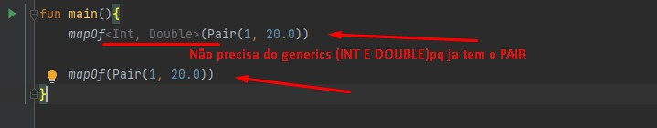
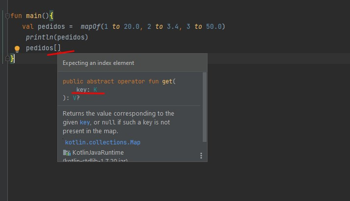

<h1>Utilizando o MAP</h1>

o map ou então o or dictionary, que seria, por exemplo, um dicionário na tradução, então o map vem de mapa, diz que isso aqui é um conjunto de chaves e
valores. No caso de pares entre chaves e valores, indicando que as chaves aqui são únicas, então dentro de um mapa, as chaves dentro da sua estrutura não se repetem.

Mapas no geral vão ser justamente esse tipo de estrutura, que a gente sempre vai focar numa chave e essa chave vai nos devolver algum valor que faça sentido, que tenha essa conexão lógica

Criando o map, e em cima dele da o ctrl + p, ele mosta `k,v` ou seja k = chave, v = valor. Fazendo uma estrutura de map temos isso:

                mapOf<Int, Double>()

o Int sera minha chave, indicando que é um inteiro e meu valor um double, so que se eu colocar os valores, ele ocorre erro.
               
               mapOf<Int, Double>(1, 20.0)

Mas porque? ] Se a gente tentar colocar 1,20 a gente vai perceber que temos um problema de compilação, porque realmente a gente não consegue dar uma relação aqui. 
Então a gente tem que colocar uma estrutura na qual ela vai conseguir conectar esses dois valores. E aqui mesmo já fala o seguinte, no erro que está passando, que para a gente conseguir colocar um valor que seja compatível a gente tem que usar essa referência chamada de pair.
Então, como a gente usa essa referência chamada de pair? Basicamente, a gente cria uma instância. Criando uma instância de pair, olha o que vai acontecer. A gente vai conseguir mandar dois valores, porque essa instância realmente vai pegar pares, vai pegar dois valores que 
têm alguma relação, que nesse caso vão ser o valor de inteiro e o double. É um único elemento dentro do map. É esse pair que a gente está vendo.

* obs:  Como a gente pode ver, não necessariamente a gente precisa determinar via generics qual o tipo, ele já consegue reconhecer para a gente a partir desse pair. É enviando vários pairs que a gente consegue armazenar valores para o nosso mapa.

E se eu quiser mais valor? Tera que ir acrescentado os pair, exemplo:

                     mapOf(Pair(1, 20.0), Pair(2, 3.4))

So que é chato e o pessoal do kotlin ja fez uma alternativa, usando o `to`. Colocando esse to a gente tem a capacidade agora de adicionar qual seria o valor que tem relação com essa chave, que seria por exemplo 50.

Exemplo: 

                  val pedidos =  mapOf(Pair(1, 20.0), Pair(2, 3.4), 3 to 50.0)

ou tudo com `to`

                   val pedidos =  mapOf(1 to 20.0, 2 to 3.4, 3 to 50.0)

Funciona:

                   val pedidos =  mapOf("Edrielle" to 20.0, 2 to 3.4, 3 to 50.0)

## Leitura de um unico elemento

Podemos fazer que nem na lista:

    `pedidos[chave]`

Eu colocaria o índice 0, correto? Ele compilou, não teve nenhum problema, porque ele pega a partir de uma chave e não verifica nesse momento de compilação qual é a chave que está aqui dentro, é no momento da execução. É tanto que se a gente observar o valor que ele devolve para a gente, vou colocar val pedido, é justamente o nullable, porque ele não sabe se realmente o valor que está aqui dentro existe.
Então, ele vai compilar, mas ao mesmo tempo vai falar “te devolvo, mas pode ser nulo”, e é nesse momento que a gente precisa fazer o trabalho. Por exemplo, agora quero verificar o valor desse pedido, posso fazer todas as técnicas que a gente viu no safety.

                fun main(){
                    val pedidos =  mapOf(1 to 20.0, 2 to 3.4, 3 to 50.0)
                    println(pedidos)
                    val pedido = pedidos[0]
                        pedido?.let {
                        println("Pedido $it")
                    }
                }

                // devolve nulo pq n tem chave 0

Agora passando a chave 1, que tem:

                fun main(){
                    val pedidos =  mapOf(1 to 20.0, 2 to 3.4, 3 to 50.0)
                    val pedido = pedidos[1]
                        pedido?.let {
                        println("Pedido $it")
                    }
                }

                // resultado
                Pedido 20.0

Podemos pegar elemento pelo for também:

A próxima observação em relação à leitura é justamente quando a gente faz o nosso for loop. Lembra que tanto a lista, collection, e o set consegue fazer isso? Também o map consegue fazer, só que de uma maneira diferente.
A gente coloca aqui o for e vou adicionar pedidos. Vou falar que temos um pedido dentro dos pedidos, e veja qual é a referência que ele mostra para a gente. É o tal de map entry, aí coloca o generics de int double. Então, quando a gente pega cada elemento aqui dentro de um map, a gente vai ter um elemento desse tipo que a gente está vendo, que esse entry, quando a gente pega desse jeito, é como se fosse uma interface dentro da interface do map.

    for(pedido in pedidos){
        println("Numero do pedido: ${pedido.key}")
        println("Numero do pedido: ${pedido.value}")
    }

ou podemos até mesmo pegar sua referência, pegando o tipo. Então, vamos colocar map entry, aqui a gente coloca o tipo da chave e o tipo do valor. Então a gente pode acessar o código para ver. Veja que é uma interface, que fica dentro da interface map. Por isso que ele vem nessa nomenclatura que a gente está vendo.

    for(pedido: Map.Entry<Int, Double>in pedidos){
        println("Numero do pedido: ${pedido.key}")
        println("Numero do pedido: ${pedido.value}")
    }

* OBS: so colocar o mouse em cima do pedido aonde vai ser atribuido os valores de pedidos e ai ele da o tipo;

* OBS: se tiver aparecendo reclamação no caso dos exemplos acima, pq usamos variavel com mesmo nome, podemos mudar o nome para parar a reclamação
clicando shift + f6 e selecionando apenas nas ocorrencias, muda o nome da variavel, tem duas opções: mudar so nas ocorrencias ou no codigo todo.
Exemplo aciama, foi que ja tinha pedido e usamos a mesma no for.

## Comportamentos de escrita do Map

Esses comportamentos estarão disponíveis em uma referência mutável. Assim como a gente viu no list, no set, aqui no map também vamos ter o mutable map.
Como a gente pode fazer para acessar essa estrutura de escrita? Para isso, a gente pode mudar a implementação de map of para mutable map of, que aí ele vai criar essa referência chamada de mutable map. É o mutable map, que vai ter uma chave de int, e vai ter um valor de double.

                    val pedidos: MutableMap<Int, Double> = mutableMapOf(1 to 20.0, 2 to 3.4, 3 to 50.0)

Para adiconar precisamos fazer:

        pedidos[4] = 70.0

        // resultado 

        {1=20.0, 2=3.4, 3=50.0, 4=70.0}

E temos o put:

        pedidos.put(5, 90.0)
        // resultado
        {1=20.0, 2=3.4, 3=50.0, 4=70.0, 5=90.0}

E atualização do valor:

     pedidos[1] = 100.0

     println(pedidos)
      // resultado
     {1=100.0, 2=3.4, 3=50.0, 4=70.0, 5=90.0}

Mesma coisa pra adicionar, serve pra alterar.

Para termos cuidado, podemos usar outro comportamento o `putIfAbsent`
Então, por exemplo, se eu quero agora adicionar o pedido número 6, posso colocar aqui número 6 com valor de 200, por exemplo. Ele vai adicionar, vamos ver isso acontecendo. Vamos pegar pedidos, executando, ele vai adicionar o pedido número 6.
Agora, se eu quiser fazer meio que a atualização desse pedido a partir desse put if absent, colocar, por exemplo, 300, ele vai tentar adicionar esse pedido, mas vai ver que ele existe e não vai fazer nada

        pedidos.putIfAbsent(6, 200.00)
        println(pedidos)
        pedidos.putIfAbsent(6, 300.00) // não adiciona pq ja tem

Remover:

        pedidos.remove(6)

A gente vai ver o 3, por exemplo, a gente vai ver que ele foi removido. Aí novamente, se às vezes você também tiver a necessidade de remover um elemento dado a sua chave, mas também relacionado ao seu valor, a gente tem uma sobrecarga nesse remove.
Então, por exemplo, no 3, só quero remover o 3 se ele tiver um valor exato a 100. Olha só que interessante, ele já consegue adicionar o valor logo em seguida como argumento. Esse 3 só vai ser removido realmente se o valor bater. Nesse caso não bateu, ele não foi removido.

        pedidos.remove(3, 100.0)  // 3 = chave e 100.0 se a chave tiver se valor, caso não tenha, não é removido
        println(pedidos)

`Adicione comportamentos de escrita para o Map que adicionam, atualizam ou removem elementos.
Para isso, primeiro converta o Map para um MutableMap, em seguida, utilize o operator [] para adicionar ou atualizar elementos, também teste com o put().
Teste também o método putIfAbsent(), que adiciona elementos apenas quando a chave não existir.
Por fim, remova um pedido usando o remove(), enviando apenas a chave, então, faça o teste com a sobrecarga que envia a chave e o valor ao mesmo tempo. Teste quando ambos existem e quando uma das informações não batem.
VER OPINIÃO DO INSTRUTOR
Opinião do instrutor`